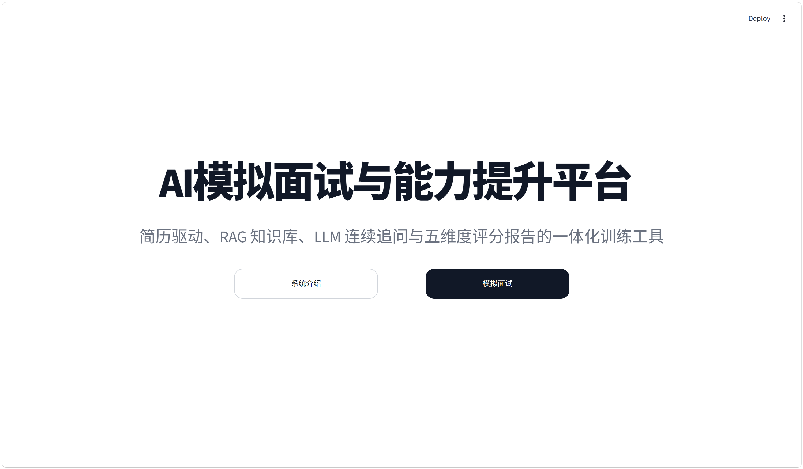
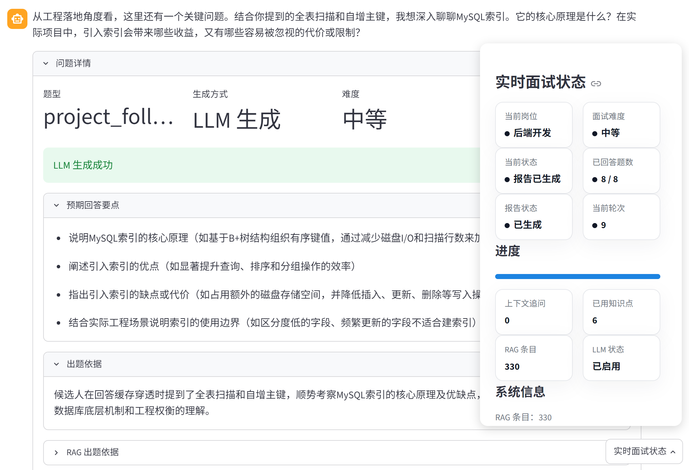
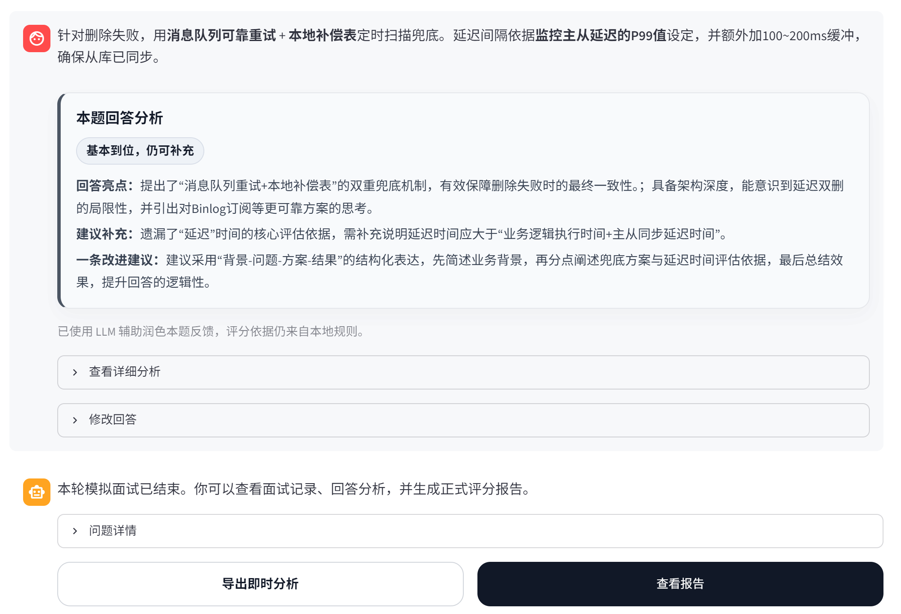
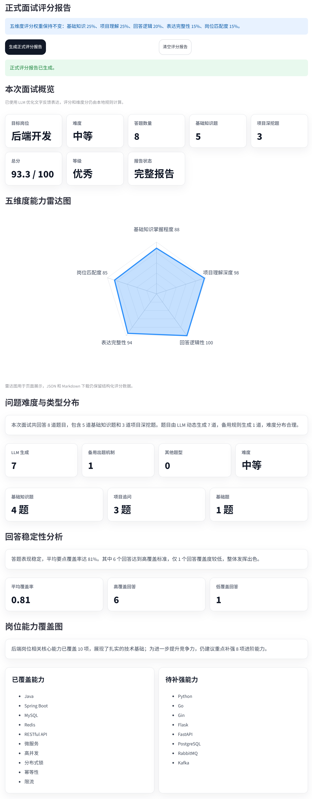
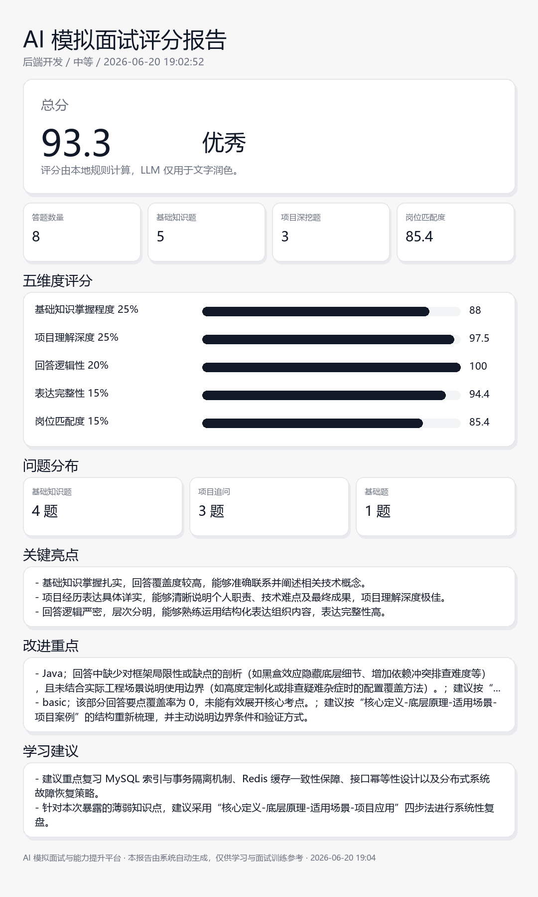
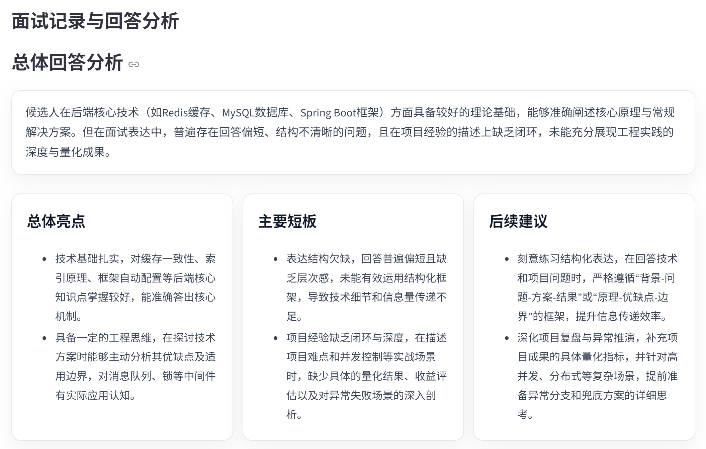

# AI 模拟面试与能力提升平台

## 项目简介

本项目是一个基于 Streamlit 的本地 Web 应用，面向计算机相关专业学生和求职者，提供从简历解析、岗位画像、RAG 知识检索、AI 模拟面试、回答分析到评分报告生成的一体化训练流程。

系统以本地运行和比赛演示为主要使用方式，强调稳定闭环、可解释出题、规则 fallback 和隐私友好的本地数据管理。

## 项目背景与目标

项目用于“2026 年利兹科技月 AI 模拟面试与能力提升软件开发赛题”。目标是让系统能够理解简历内容，围绕目标岗位开展模拟面试，并给出结构化能力诊断与提升建议。

核心闭环：

```text
简历解析 -> 可解释 RAG 出题 -> 用户回答 -> 单题即时分析
-> 动态追问 -> 总体回答分析 -> 逐题复盘导出
-> 最终五维报告 -> 历史能力成长
```

## 系统展示



图 1 平台首页与主要功能入口。



图 2 模拟面试工作区，展示问题详情、生成方式、难度、LLM 生成结果、RAG 出题依据、回答分析区域、进度与实时面试状态。



图 3 答后即时分析、修改重答与逐题 Markdown 复盘导出。



图 4 评分报告仪表盘，展示总分、等级、五维能力、问题分布和稳定性分析。



图 5 系统生成的报告摘要海报 PNG。完整长图示例可查看：[完整报告长图 PNG](docs/assets/report_full_long.png)。

## 核心功能

- 支持手动粘贴简历文本。
- 支持 TXT / PDF / DOCX 简历或项目材料上传。
- 支持多文件材料合并解析。
- 支持结构化简历解析，并在 LLM 不可用时使用本地规则 fallback。
- 支持目标岗位和面试难度选择。
- 支持候选人画像、面试重点、潜在薄弱项、简历-岗位匹配提醒和简历优化建议。
- 支持本地 JSON RAG 知识库检索和岗位导向选题。
- 支持友好的 RAG 出题依据展示，包括知识点、考察要点、参考依据和项目场景。
- 支持 LLM + RAG 生成自然面试问题，并保留规则备用出题机制。
- 支持连续追问、项目深挖和基础知识追问。
- 支持回答关键词、覆盖率、逻辑性、完整性和缺失要点分析。
- 单题即时分析：展示回答亮点、主要遗漏、风险表述和改进方向。
- 总体回答分析：跨题总结稳定优势、重复问题和优先训练路径。
- LLM 可选反馈润色：qwen3.7-plus 只辅助自然表达，不修改覆盖率、分析证据、最终分数或五维权重。
- 本地规则反馈 fallback：模型不可用时仍可生成训练反馈。
- 修改并重新提交：更新最近回答及对应分析，不产生重复记录。
- 逐题复盘导出：导出不包含完整参考答案的 Markdown。
- 最终五维报告：基于完整面试统一生成综合能力评价。
- 支持五维度评分报告、不完整面试提醒、回答稳定性、问题类型分布、岗位能力覆盖和薄弱点卡片。
- 支持评分置信度、项目证据充分性提示和误区/关键错误识别。
- 支持评分报告 Markdown、JSON、完整长图 PNG、摘要海报 PNG，以及即时回答分析复盘 Markdown 导出。
- 支持本地历史面试会话、报告复盘和能力成长曲线。
- 支持演示模式，内置五类虚构岗位样例简历和回答模板。

## 系统亮点

- 完整闭环：从简历到面试再到评分报告和成长复盘。
- 可解释出题：RAG 决定考察知识点，LLM 负责自然表达。
- 五岗位覆盖：后端开发、前端开发、AI应用开发、数据分析、软件测试共用统一岗位能力词库。
- 项目深挖调度：完整面试中会尽量保证项目深挖和上下文追问数量。
- 即时训练闭环：用户答题后可立即查看轻量反馈，并修改最近回答重新提交。
- LLM 辅助边界清晰：LLM 只优化反馈表达，不修改覆盖率、临时分或最终五维评分。
- fallback 完整：LLM 超时、关闭或返回异常时，系统仍可继续面试和生成报告。
- 报告可解释：评分是基于结构化证据和启发式规则形成的训练型辅助评价，LLM 只润色文字。
- 适合演示：本地运行、样例数据、历史会话和多格式报告导出都可独立展示。

## 技术栈

- Python
- Streamlit
- JSON 本地知识库
- OpenAI-compatible Chat Completions API
- 阿里云百炼 / DashScope OpenAI 兼容 Chat Completions API（qwen3.7-plus）
- pdfplumber：PDF 简历读取
- python-docx：DOCX 简历读取
- python-dotenv：本地环境变量管理
- requests：LLM API 请求
- Pillow：评分报告 PNG 导出

## 系统工作流程

```text
用户输入或上传简历
  -> 简历文本读取与多文件合并
  -> 结构化简历解析
  -> 候选人画像与岗位匹配分析
  -> RAG 知识点检索
  -> 尝试调用 LLM 生成问题
      -> 成功：使用 LLM + RAG 动态问题
      -> 失败：使用本地规则备用问题
  -> 用户回答
  -> 单题即时分析
  -> 动态追问
  -> 总体回答分析
  -> 逐题复盘导出
  -> 最终五维报告
  -> 历史能力成长
```

单题即时分析用于当前回答纠错；总体回答分析用于跨题归纳稳定模式；最终报告用于完整面试后的综合能力评价。若开启“LLM 辅助反馈润色”且 LLM 配置可用，系统会在本地规则分析后润色每题反馈和总体回答分析；LLM 只辅助自然表达，不修改覆盖率、分析证据、最终分数或五维权重，超时或关闭时自动回退本地规则。


## 即时回答分析与逐题复盘

每次提交回答后，系统会立即展示回答亮点、主要遗漏、风险表述和改进方向。分析依据由本地规则生成；启用 LLM 辅助反馈润色后，qwen3.7-plus 只优化文字表达，不修改评分数据。用户可修改最近回答重新提交，并在面试结束后导出逐题即时分析 Markdown，用于复盘。

导出的复盘材料包含每题问题、用户回答、覆盖点、缺失点、风险提示和改进建议，不包含完整参考答案。即时分析用于单题训练反馈；最终五维评分仍由完整面试结束后的正式评分报告统一生成。


## 三层反馈与复盘

平台提供三层互补反馈：每题提交后的单题即时分析帮助用户当场纠错；总体回答分析跨题识别稳定优势、重复遗漏和风险模式；最终五维报告则基于完整面试统一评价综合能力。

- 单题即时分析：面向当前回答，展示覆盖点、缺失点、风险表述和一条可执行建议，并支持修改最近回答重新提交。
- 总体回答分析：面向整场回答，重新组织已有回答证据和改进优先级，识别稳定优势、重复遗漏、风险模式、回答结构特点和工程思维特点，不直接修改最终五维评分。
- 最终五维报告：面向完整面试，统一展示总分、五维评分、置信度、岗位能力覆盖、学习建议、简历建议和历史成长数据。



图 7 总体回答分析将多道题的零散反馈汇总为稳定优势、重复问题和优先改进路径。

## 快速开始

首次运行：

```bat
python -m venv .venv
.venv\Scripts\activate
pip install -r requirements.txt
streamlit run app.py
```

日常运行：

```bat
.venv\Scripts\activate
streamlit run app.py
```

完成首次环境配置后，也可以双击：

```text
start_app.bat
```

`start_app.bat` 只负责进入项目目录，并使用 `.venv\Scripts\python.exe -m streamlit run app.py` 启动应用，不会自动安装依赖。

## 详细运行说明

运行自检：

```bash
python scripts/self_check.py
```

如果启动时出现 `No Python at ...WindowsApps...`，通常表示本地 `.venv` 绑定的 Python 路径已经失效。请删除并重建 `.venv` 后重新安装依赖。

## LLM 配置与无密钥模式

复制配置模板：

```bash
copy .env.example .env
```

在 `.env` 中填写：

```env
USE_LLM=true
LLM_API_KEY=your_api_key_here
LLM_BASE_URL=https://dashscope.aliyuncs.com/compatible-mode/v1
MODEL_NAME=qwen3.7-plus
```

如果没有 API Key，或需要测试本地备用流程：

```env
USE_LLM=false
```

修改 `.env` 后需要重启 Streamlit。不要提交 `.env`，也不要在截图、文档或提交记录中暴露真实 API Key。

## RAG 知识库说明

知识库文件位于：

```text
data/knowledge_base.json
```

每条知识点包含 ID、分类、标签、难度、题型、问题、参考答案、期望回答要点、追问方向、项目场景和来源字段。当前知识库为 330 条；本轮扩展从 300 条小幅增加到 330 条，重点补齐五岗位能力、项目深挖、故障排查、测试验证和常见误区，而不是追求条目数量。

当前检索采用本地可解释关键词检索和岗位导向排序，不依赖向量数据库或额外服务。系统会根据目标岗位、技能关键词、难度、近期已使用知识点等因素选择问题，并尽量避免短时间重复考察同一知识点。知识库还支持可选的 `common_mistakes`、`misconceptions`、`critical_errors`、`evidence_requirements` 等字段，用于识别明确误区和证据不足。

## 评分与反馈体系

最终报告采用固定五维度评分：

| 维度 | 权重 |
|---|---:|
| 基础知识掌握程度 | 25% |
| 项目理解深度 | 25% |
| 回答逻辑性 | 20% |
| 表达完整性 | 15% |
| 岗位匹配度 | 15% |

LLM 只用于问题自然表达和报告文字润色，不改变分数、题数或权重。若 LLM 不可用，报告文字会使用本地规则生成。

报告还会给出 `scoring_confidence`、`dimension_confidence` 和项目证据充分性提示。若本轮项目深挖题不足，系统会显示“本轮项目深挖题数量不足，该维度评价可信度较低。”，避免把调度证据不足隐藏成确定性结论。

评分主要服务于训练、自我复盘和面试准备，不应作为真实招聘录用或个人能力认定的唯一依据。

## 演示模式

`demo/` 目录中的样例材料均为虚构内容，可用于比赛录屏、现场演示和功能测试。当前包含五个目标岗位：

- 后端开发
- 前端开发
- AI 应用开发
- 数据分析
- 软件测试

侧边栏“演示模式”可加载示例简历，并显示对应岗位回答模板。

## 报告导出

评分报告支持：

- Markdown 下载
- JSON 下载
- 完整报告长图 PNG
- 报告摘要海报 PNG

完整长图适合归档，摘要海报适合展示和视频演示。

## 能力成长曲线

系统会基于本地历史评分报告生成能力成长曲线，比较多次面试的总分和五维度变化。若 LLM 可用，成长分析文字可由 LLM 润色；若 LLM 关闭或超时，则使用本地规则分析。

## 项目目录结构

```text
AI模拟面试与能力提升平台/
├─ app.py
├─ start_app.bat
├─ requirements.txt
├─ README.md
├─ .env.example
├─ data/
│  └─ knowledge_base.json
├─ demo/
│  ├─ README.md
│  ├─ sample_resume_ai_app.txt
│  ├─ sample_resume_backend.txt
│  ├─ sample_resume_frontend.txt
│  ├─ sample_resume_data_analysis.txt
│  ├─ sample_resume_testing.txt
│  ├─ sample_answers_ai_app.md
│  ├─ sample_answers_backend.md
│  ├─ sample_answers_frontend.md
│  ├─ sample_answers_data_analysis.md
│  └─ sample_answers_testing.md
├─ docs/
│  ├─ Project_Design_Document.pdf
│  ├─ Project_Design_Document.md
│  ├─ demo_script.md
│  ├─ final_submission_checklist.md
│  ├─ llm_config_guide.md
│  ├─ rag_build_guide.md
│  ├─ test_checklist.md
│  └─ assets/
│     ├─ homepage.png
│     ├─ resume_analysis_01_input.png
│     ├─ resume_analysis_02_candidate_profile.png
│     ├─ resume_analysis_03_role_match.png
│     ├─ interview_workspace.png
│     ├─ answer_analysis_export.png
│     ├─ answer_analysis_summary.png
│     ├─ sidebar_navigation_01.png
│     ├─ sidebar_navigation_02.png
│     ├─ rag_evidence.png
│     ├─ final_report_dashboard.png
│     ├─ ability_growth_curve.png
│     ├─ report_summary_poster.png
│     ├─ report_full_long.png
│     ├─ system_architecture.png
│     └─ README.md
├─ scripts/
│  ├─ scoring_calibration_check.py
│  └─ self_check.py
├─ src/
│  ├─ __init__.py
│  ├─ answer_analyzer.py
│  ├─ evaluator.py
│  ├─ interviewer.py
│  ├─ llm_client.py
│  ├─ llm_feedback_polisher.py
│  ├─ llm_interviewer.py
│  ├─ product_features.py
│  ├─ profile_generator.py
│  ├─ prompts.py
│  ├─ rag_display.py
│  ├─ rag_retriever.py
│  ├─ report_image_exporter.py
│  ├─ resume_file_loader.py
│  ├─ resume_parser.py
│  └─ session_manager.py
└─ outputs/
   └─ logs/
```

`outputs/sessions/`、`outputs/reports/`、`outputs/report_images/` 为运行时生成目录，已在 `.gitignore` 中忽略。

## 文档导航

- [项目设计文档（PDF 正式版）](docs/Project_Design_Document.pdf)
- [项目设计文档（Markdown 在线版）](docs/Project_Design_Document.md)
- [RAG 覆盖审计](docs/rag_coverage_audit.md)
- [LLM 配置教程](docs/llm_config_guide.md)
- [RAG 知识库构建说明](docs/rag_build_guide.md)
- [演示视频脚本](docs/demo_script.md)
- [测试清单](docs/test_checklist.md)
- [最终提交清单](docs/final_submission_checklist.md)
- [演示数据说明](demo/README.md)
- [文档图片资源说明](docs/assets/README.md)

## 测试与自检

提交前建议运行：

```bat
python scripts/self_check.py
python scripts/scoring_calibration_check.py
python -m compileall app.py src scripts
git diff --check
git status
```

正式提交和固定排版版本为 `docs/Project_Design_Document.pdf`；Markdown 文件用于 GitHub 在线阅读。最终提交格式以官方赛题文件和通知为准。

已验证环境：

| 项目 | 版本 / 状态 |
|---|---|
| 操作系统 | Windows 本地环境 |
| Python | 3.12.13 |
| Streamlit | 1.58.0 |
| 知识库 | 运行自检可查看当前条目数 |
| LLM API | 需作者本地配置真实 Key 后验证 |

## 安全与隐私

- `.env` 不应提交到 GitHub。
- `.env.example` 只包含占位值。
- 真实简历、真实面试记录和真实评分报告不应上传公开仓库。
- `outputs/sessions/`、`outputs/reports/`、`outputs/report_images/` 已被忽略。
- 本项目适合作为比赛和教学演示项目，不宣称具备生产级安全合规能力。

## AI 辅助开发说明

本项目使用 AI 辅助进行需求拆解、代码优化、文档整理和测试思路梳理。人工开发与审查重点包括：保持闭环稳定、保留 fallback、避免硬编码密钥、验证评分权重不变、检查自检脚本和演示材料。

## 已知限制

- 当前 RAG 检索为本地关键词检索，未接入真正的向量数据库。
- 评分规则是启发式方法，适合训练和演示，不等同于真实招聘评价，也不宣称完全客观。
- LLM 调用受网络、账号权限、模型可用性和地区 endpoint 影响。
- 云部署、权限系统、审计日志和生产级隐私合规不在当前提交范围内。

## 提交说明

提交 GitHub 前请确认：

- 已运行 `python scripts/self_check.py`。
- `.env` 未提交。
- `.env.example` 不包含真实密钥。
- 真实简历、真实面试记录和真实报告未提交。
- README、设计文档、演示材料与当前功能一致。

推荐命令：

```bash
git status
git add -A
git status
git commit -m "Finalize documentation and integrate project screenshots"
git pull --rebase origin main
git push origin main
```

可选最终标签：

```bash
git tag final-submission
git push origin final-submission
```
