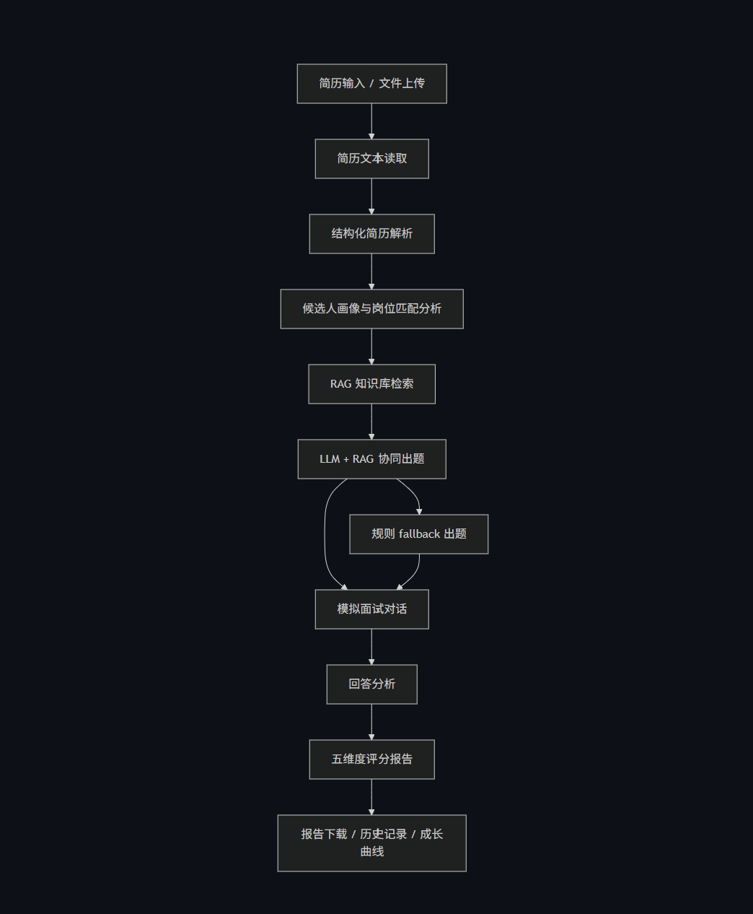
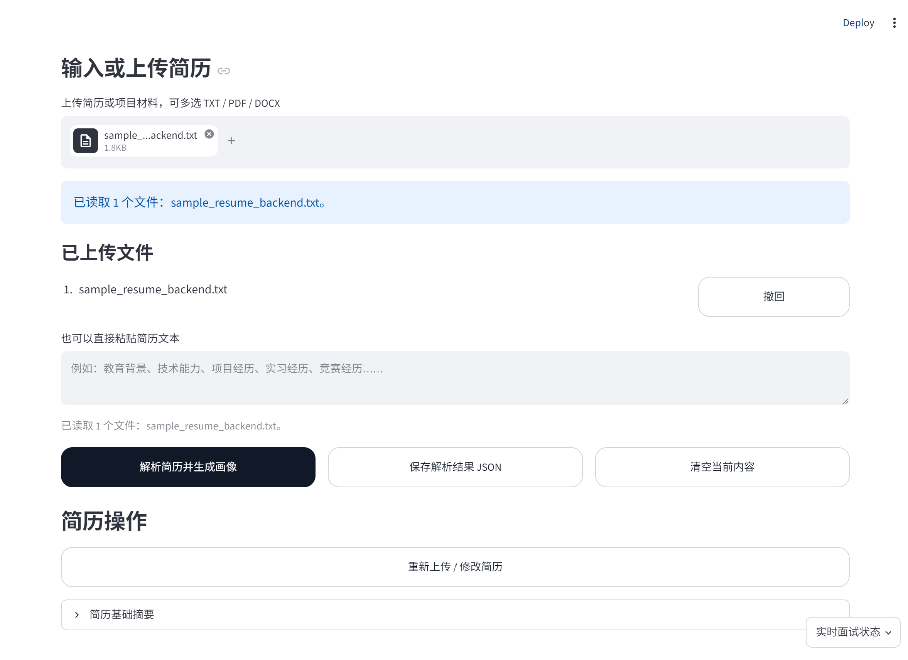
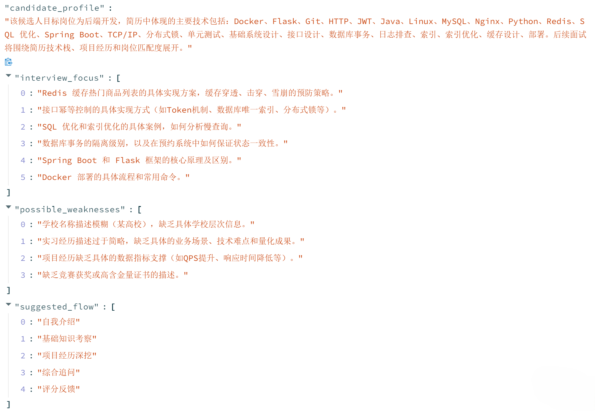
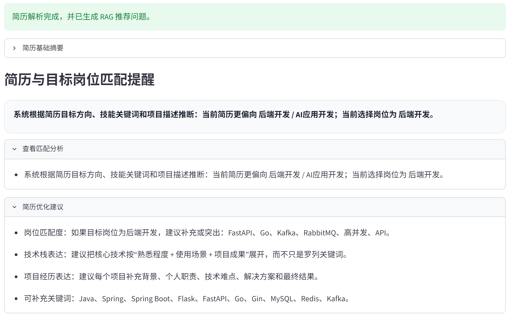
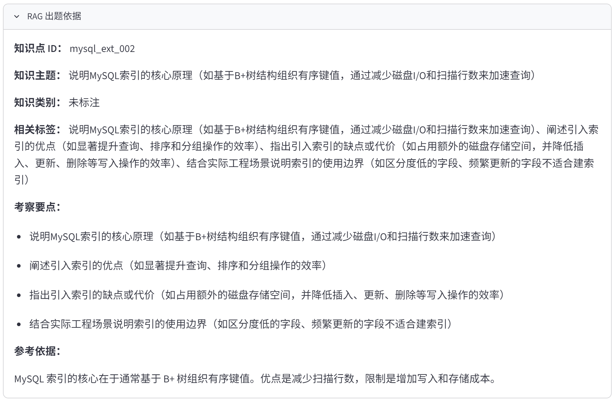
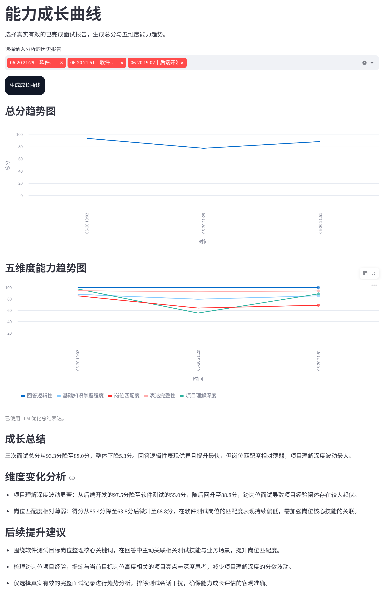
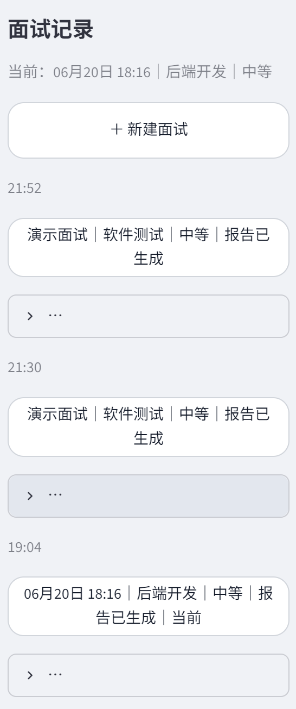
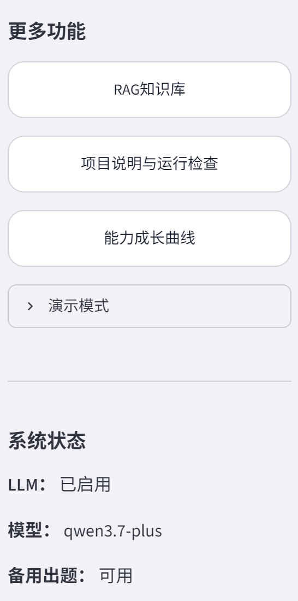

# AI 模拟面试与能力提升平台项目设计文档

> 本文件用于 GitHub 在线阅读；正式固定排版版本见同目录下的 `Project_Design_Document.pdf`。

## 1. 项目背景与目标

本项目面向计算机相关专业学生和求职者，提供一个由简历驱动的模拟面试与能力提升平台。系统目标不是替代真实面试官，而是帮助用户围绕简历、目标岗位和项目经历进行训练、复盘和改进。

平台强调本地可运行、过程可解释、LLM 异常时可降级、评分依据可追溯。用户可以完成从简历解析、候选人画像、RAG 出题、连续面试、回答分析、评分报告到历史成长复盘的完整闭环。

## 2. 需求分析

系统支持简历文本输入、TXT/PDF/DOCX 上传、岗位与难度选择、RAG 检索、LLM 动态提问、规则备用出题、项目深挖、回答分析、评分报告、历史记录、能力曲线和演示模式。

比赛演示环境可能出现网络超时、API 权限不足或无密钥情况，因此核心流程必须可以在 `USE_LLM=false` 下继续运行。评分与建议主要用于学习训练、自我复盘和面试准备，不应作为真实招聘录用或个人能力认定的唯一依据。

## 3. 系统总体架构

系统主链路为：简历输入进入解析模块，生成候选人画像和岗位匹配信息；RAG 检索模块根据岗位、技能关键词、难度和已用知识点选择问题依据；LLM 在可用时负责生成自然表达，失败时由本地规则 fallback 接管；回答进入分析与评分模块后生成结构化报告，并由会话管理模块保存历史记录。

## 4. 技术栈与运行环境

| 类别 | 技术 |
|---|---|
| Web 框架 | Streamlit |
| 开发语言 | Python |
| 知识库 | 本地 JSON 文件 |
| LLM 接口 | OpenAI-compatible Chat Completions API |
| 简历读取 | pdfplumber、python-docx、TXT 文本读取 |
| 配置管理 | python-dotenv |
| 网络请求 | requests |
| 图片导出 | Pillow |
| 正式设计文档 | `docs/Project_Design_Document.pdf` 为用户确认的固定排版提交版本 |

本地验证环境为 Windows、Python 3.12 和 Streamlit。启动方式以 README 为准，常用命令为 `.venv\Scripts\activate` 后运行 `streamlit run app.py`。

## 5. 简历解析与候选人画像

系统支持粘贴简历文本，也支持 TXT、PDF、DOCX 文件上传和多文件合并。简历解析优先尝试 LLM，失败时使用本地规则提取基本信息、技能、项目、面试重点和薄弱项。岗位匹配模块会根据目标岗位、简历目标方向、技能关键词和项目描述给出温和提醒，并生成简历优化建议。

## 6. 五岗位能力模型

系统支持五个目标岗位：后端开发、前端开发、AI应用开发、数据分析、软件测试。岗位能力词库统一维护在 `src/product_features.py`，RAG 检索和报告能力覆盖共用该来源，避免多处配置不一致。

| 岗位 | 能力覆盖重点 |
|---|---|
| 后端开发 | Java/Python/Go、Spring/FastAPI/Gin、MySQL、Redis、消息队列、高并发、微服务、部署与监控 |
| 前端开发 | HTML/CSS/JavaScript/TypeScript、Vue/React、组件化、状态管理、跨域、性能、安全、E2E 测试 |
| AI应用开发 | LLM API、Prompt Engineering、RAG、结构化输出、Token 管理、fallback、幻觉控制、工具调用 |
| 数据分析 | SQL、Pandas、数据清洗、指标体系、A/B 测试、漏斗留存、统计显著性、结论表达 |
| 软件测试 | 测试用例设计、接口测试、pytest、Mock、回归测试、Flaky Test、性能测试、LLM/RAG 测试 |

## 7. RAG 知识库来源与构建

知识库位于 `data/knowledge_base.json`，当前为 330 条。本轮优化不是大规模扩容，而是从 300 条小幅增加到 330 条，重点补齐五岗位能力、项目深挖、故障排查、测试验证和常见误区。

当前检索采用本地可解释关键词检索，不声明使用向量数据库、embedding、BM25 或 rerank 模型。系统会根据目标岗位、技能关键词、难度、近期已使用知识点等因素选择问题，并尽量避免短时间重复考察同一知识点。

## 8. LLM、RAG 与规则 fallback 协同机制

RAG 决定“考察什么”，LLM 决定“如何自然表达”。系统把候选人画像、最近对话、RAG 条目和 fallback 模板传给 LLM，并要求返回合法 JSON，保留 `knowledge_id`、`expected_points`、`reference_answer`、`reason` 和 `difficulty` 等元数据。

若 LLM 未启用、超时、返回格式异常或返回近期重复知识点，系统使用规则 fallback。成功 LLM 题目显示 `generated_by=llm`；fallback 题目显示 `generated_by=rule_fallback` 并记录 `fallback_reason`。

## 9. 面试流程与项目深挖调度

完整面试约 8 题，目标结构包括开场题、RAG 知识或工程题、至少 2 道项目深挖题、至少 1 道上下文追问，以及可选综合岗位匹配题。调度逻辑位于 `src/interviewer.py`，会在接近结束时修复项目深挖或追问不足。

每次提交回答后，系统生成单题即时分析；完成多道题后，总体回答分析跨题汇总稳定优势、重复遗漏、风险模式与训练优先级；面试结束后，最终报告再基于全部记录统一生成五维综合评价。总体回答分析不重新改变评分权重，而是整理已有回答证据并明确下一轮训练重点。

若简历项目证据不足，系统不会编造项目细节，而是在报告中记录 `project_evidence_sufficient=false`、`project_evidence_confidence=low`，并提示“本轮项目深挖题数量不足，该维度评价可信度较低”。

## 10. 回答分析与评分校准

回答分析位于 `src/answer_analyzer.py`，优先使用 `expected_points`，再结合参考答案、标签、中文语义短语和技术关键词进行覆盖率判断。系统支持识别可选误区字段，例如 MySQL 执行计划、RAG 幻觉、缓存穿透和自动化测试中的典型错误说法。

每次提交回答后，系统先通过本地规则生成单题即时分析，展示已覆盖要点、主要遗漏、风险表述和改进方向。完成多道题后，总体回答分析会基于全部已有回答记录，跨题整理稳定优势、重复遗漏、风险模式和优先训练路径。启用 LLM 辅助反馈润色时，模型只优化反馈文字表达，不修改本地规则生成的覆盖点、缺失点、风险标记、临时表现或最终评分。活跃面试期间不会展示完整参考答案，完整五维评分仍在完整面试结束后统一生成。

完整面试结束后，用户可独立导出即时分析 Markdown，其中包含每题问题、用户回答、覆盖点、缺失点、风险表述与改进建议，但不包含完整参考答案。该复盘材料用于单题训练回看，正式五维综合评价仍以评分报告为准。

图 5 答后即时分析与逐题复盘导出：展示回答亮点、主要遗漏、风险表述、改进建议，以及面试结束后的即时分析 Markdown 导出入口。

图 6 总体回答分析展示跨题摘要、总体亮点、主要短板和后续建议，用于把零散单题反馈整理为训练优先级。

最终评分保持五个顶层维度和权重不变：

| 维度 | 权重 |
|---|---:|
| 基础知识掌握程度 | 25% |
| 项目理解深度 | 25% |
| 回答逻辑性 | 20% |
| 表达完整性 | 15% |
| 岗位匹配度 | 15% |

评分校准重点包括：不因关键词堆砌直接给高分，不因结构词直接给逻辑满分，长篇重复回答会受到信息密度限制，明确技术误区会影响技术得分，项目深挖证据不足时降低置信度而不是隐藏问题。

## 11. 评分报告与能力成长

报告包含总分、等级、五维评分、评分置信度、问题分布、回答稳定性、岗位能力覆盖、薄弱点卡片、学习建议和简历优化建议。LLM 只允许润色文字反馈，不允许修改分数、权重、题数和证据标记。

系统将历史会话保存到 `outputs/sessions/`，可生成多次面试的总分和五维度趋势。报告支持 JSON、Markdown、完整长图 PNG 和摘要海报 PNG 导出。

## 12. 界面与交互设计

界面保持黑白灰风格，首页提供“系统介绍”和“模拟面试”入口。系统介绍页说明平台定位、工作流程、技术特色和使用边界；模拟面试页聚焦当前问题、问题详情、回答提交、答后分析、报告跳转和状态展示。单题分析采用紧凑的可折叠卡片，总体回答分析采用跨题摘要和分组建议，最终报告则使用图表与指标展示综合结论。三者在信息层级和视觉样式上保持区分。侧边栏提供“答后即时分析”和“LLM 辅助反馈润色”两个轻量开关。面试结束时，“导出即时分析”和“查看报告”并排展示，前者用于逐题复盘，后者进入正式五维评分报告。

图 6-1 左侧栏的面试记录区域，包含当前面试、新建面试按钮和历史面试卡片。

图 6-2 左侧栏的更多功能与系统状态区域，包含 RAG 知识库、项目说明与运行检查、能力成长曲线、演示模式和 LLM 状态。

图 7 模拟面试工作区展示当前问题、问题详情、生成方式、难度、LLM 生成成功、预期回答要点、RAG 出题依据、实时面试状态、已回答题数、RAG 条目数和 LLM 状态。

## 13. 安全、隐私与 API Key 管理

API Key 通过 `.env` 管理，`.env` 已加入 `.gitignore`，仓库只保留 `.env.example`。真实简历、真实会话、真实报告和密钥不应提交公开仓库。`outputs/sessions/`、`outputs/reports/`、`outputs/report_images/` 为运行产物目录，默认忽略。

## 14. 系统测试与运行结果

| 测试项 | 状态说明 |
|---|---|
| `python scripts/self_check.py` | 提交前需最终运行，检查文件结构、图片、隐私和链接 |
| `python scripts/scoring_calibration_check.py` | 用离线样例验证低、中、高回答分数梯度和误区识别 |
| `python -m compileall app.py src scripts` | 提交前需最终运行，检查 Python 语法 |
| RAG 条目数 | 当前为 330 条 |
| `USE_LLM=false` fallback | 逻辑保留，适合无网络或无密钥演示 |
| `USE_LLM=true` | 需使用真实 Key 在本地人工验证 |
| 正式 PDF | 已复制用户确认的最终 PDF，采用 A4 固定排版 |

## 15. AI 辅助开发与人工审查

本项目在需求拆解、模块实现、Prompt 设计、UI 文案、测试清单和文档整理中使用了 AI 辅助，但最终范围、集成、调试和审查由人工完成。

人工审查重点包括：Prompt JSON 格式与异常处理、Streamlit session-state 时序、LLM timeout 与 fallback、`generated_by/fallback_reason` 一致性、RAG display ID、评分校准、报告 PNG 排版和仓库隐私检查。

## 16. 创新点、局限性与后续展望

创新点包括：简历画像、RAG 检索、LLM 出题、评分报告和成长复盘形成完整闭环；本地可解释 RAG 能说明“为什么问这道题”；LLM 异常时 fallback 保证演示稳定；评分报告加入证据、置信度、薄弱点和训练建议；支持五岗位能力覆盖和软件测试方向专项补强。

局限性包括：当前检索仍是本地关键词检索，没有真正向量数据库；评分是启发式训练辅助评价，不宣称完全客观；LLM 能力受网络、模型权限、地区 endpoint 和 API Key 影响；当前系统面向本地比赛演示，未实现生产级权限、审计和云端合规。

后续可扩展方向包括向量检索、更多岗位模板、语音面试、云端部署、团队账号权限和更系统的人工评分样本校准。
