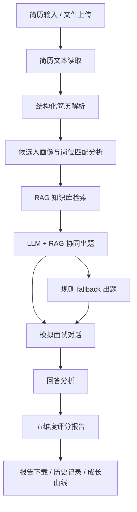

# AI 模拟面试与能力提升平台项目设计文档

## 1. 项目背景与目标

本项目面向“AI 模拟面试与能力提升”软件开发赛题，目标是为计算机相关专业学生提供一个可本地运行、可演示、可解释的模拟面试训练平台。系统以简历为入口，结合目标岗位、RAG 知识库和 LLM 生成能力，完成模拟面试、回答分析、五维度评分和后续学习建议。

项目重点不是搭建复杂云平台，而是在有限时间内完成稳定闭环：简历输入 -> 画像生成 -> 知识检索 -> 模拟面试 -> 回答分析 -> 评分报告 -> 成长复盘。

## 2. 系统总体架构



系统采用单体 Streamlit 应用结构，前端界面、业务编排和本地数据管理集中在 `app.py`，核心能力拆分到 `src/` 目录中的独立模块。

## 3. 技术栈与运行环境

- 开发语言：Python
- Web 框架：Streamlit
- 本地知识库：JSON
- LLM 接口：OpenAI-compatible API，兼容阿里云百炼 / DashScope
- 文件读取：pdfplumber、python-docx
- 配置管理：python-dotenv
- 数据格式：JSON、Markdown
- 推荐运行方式：Windows 本地虚拟环境

运行命令：

```bash
pip install -r requirements.txt
streamlit run app.py
```

## 4. 核心功能模块设计

### 4.1 简历输入与解析

系统支持文本粘贴和 TXT / PDF / DOCX 文件上传。文件读取后统一转换为文本，再进入结构化解析流程。LLM 可用时优先进行结构化解析，失败时自动切换到本地启发式解析，保证演示不中断。

### 4.2 用户画像与岗位匹配提醒

画像模块从简历中提取技能栈、项目名称、目标岗位、可能短板和面试重点。系统支持用户手动选择目标岗位与难度，并检测简历内容与目标岗位是否存在方向不一致，给出温和提醒和简历优化建议。

### 4.3 RAG 知识库与检索

知识库位于 `data/knowledge_base.json`。条目包含 ID、分类、标签、难度、题型、问题、答案、期望要点、追问信息和项目场景。检索逻辑根据岗位、技能关键词、难度、最近上下文和已使用知识点排序，并尽量避免短时间重复考察同一知识点。

### 4.4 LLM 面试官与连续追问

LLM 出题模块接收候选人画像、最近对话、RAG 条目和 fallback 模板题，生成自然中文面试题。系统要求 LLM 保留 `knowledge_id`、`expected_points`、`reference_answer`、`reason` 等结构化元数据。若 LLM 不可用或返回异常，系统使用规则 fallback 继续出题。

### 4.5 回答分析与五维度评分

回答分析模块计算关键词、回答长度、逻辑表达、覆盖率、缺失要点和临时评分。最终报告按照固定五维度计算：

| 维度 | 权重 |
|---|---:|
| 基础知识掌握程度 | 25% |
| 项目理解深度 | 25% |
| 回答逻辑性 | 20% |
| 表达完整性 | 15% |
| 岗位匹配度 | 15% |

评分由本地规则计算，LLM 只参与文字润色，不改变权重和分数。

### 4.6 评分报告与学习建议

报告包含总分、等级、五维度详情、评分证据、表现亮点、主要问题、简历建议、错题与薄弱知识点、学习建议和后续提升建议。新增辅助分析包括回答稳定性、问题类型分布、岗位能力覆盖图和薄弱点卡片。

### 4.7 面试历史与能力成长曲线

系统将本地会话保存为 JSON，支持切换历史面试、查看报告和生成能力成长曲线。成长曲线比较多次报告中的总分和维度变化，并可调用 LLM 润色成长分析。

### 4.8 演示模式

演示模式使用虚构样例简历和样例回答，便于比赛视频录制和现场展示。真实简历、真实历史记录和真实报告不应上传到公开仓库。

## 5. RAG 知识库设计

知识库采用轻量 JSON 方案，适合本地演示和快速迭代。条目设计强调可解释性：每道题都能追溯到知识点、参考答案和期望回答要点。为保持历史兼容，旧 ID 不直接删除；如果某些知识点在 UI 中容易造成岗位理解偏差，系统通过 `display_id`、`display_category`、`display_topic` 增加展示映射。

## 6. LLM 与 fallback 机制

系统所有关键 LLM 调用都有 fallback：

- 简历解析失败时使用本地解析。
- LLM 出题失败时使用规则题。
- 报告润色失败时使用本地规则文案。
- 成长曲线润色失败时使用本地分析。

这种设计保证在网络不稳定、API 超时或 `USE_LLM=false` 的情况下，系统仍能完成完整面试闭环。

## 7. 评分反馈体系设计

评分报告以结构化证据为基础，不让 LLM 自由决定分数。基础知识主要参考 RAG 题和覆盖率，项目理解参考项目回答中的职责、难点和结果，逻辑性参考表达结构，完整性参考回答长度和要点覆盖，岗位匹配参考简历技能与回答内容的关联。

新增的回答稳定性、问题分布和岗位能力覆盖属于辅助诊断，不改变总分。

## 8. 系统交互与界面设计

界面采用黑白灰简洁风格，包含主页、系统介绍、模拟面试工作台、RAG 知识库、自检页和能力成长曲线。工作台使用标签页组织简历解析、模拟面试、面试记录和评分报告。面试结束后提供“查看报告”入口，减少用户手动寻找报告区的成本。

## 9. 安全与隐私设计

系统默认本地运行，API Key 通过 `.env` 环境变量配置，不在源码中硬编码。`.env` 不应提交到 GitHub，`.env.example` 只保留占位配置。真实简历和真实面试记录不应上传到公开仓库。当前项目适合比赛和教学演示，不宣称具备生产级隐私合规能力。

## 10. 测试与运行结果

项目提供 `scripts/self_check.py` 用于基础自检，检查关键文件、知识库、配置模板和核心模块是否存在。手工测试流程包括：启动应用、解析简历、生成画像、查看 RAG 结果、完成面试、编辑回答、生成报告、下载 Markdown / JSON、切换历史会话和查看成长曲线。

## 11. AI 辅助开发说明

本项目使用 AI 辅助进行需求拆解、代码优化、文档整理和测试清单生成。AI 辅助开发重点服务于工程落地：保持已有闭环、补充 fallback、增强报告可解释性、完善 README 和设计文档。最终实现仍以可运行代码和本地测试结果为准。

## 12. 项目创新点与不足

创新点：

- 将简历画像、RAG 检索、LLM 出题和评分报告串成完整训练闭环。
- 保留 RAG 证据和题目元数据，使面试问题可追溯。
- 通过 fallback 保证演示稳定性。
- 报告同时提供评分、弱点、学习建议和能力成长分析。

不足：

- 当前检索仍以本地关键词匹配为主，尚未接入真正向量数据库。
- 当前系统主要面向本地演示，未完成生产级权限、审计和云部署。
- 评分规则仍是启发式方法，后续可结合更多真实样本校准。

## 13. 后续展望

后续可继续扩展知识库质量，引入 Embedding 与向量检索，增加更多岗位模板，完善语音面试、自动录屏、报告导出排版和云端部署能力。在保证隐私安全的前提下，也可以引入更多真实匿名样本来校准评分规则。
